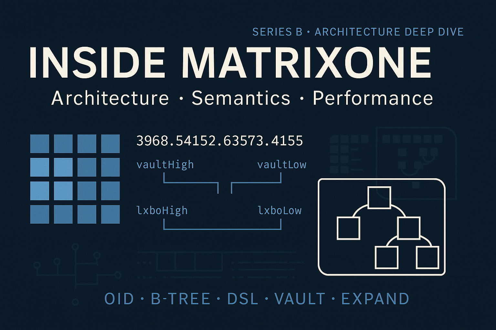

# MatrixOne Internals — Architecture, Semantics, and Performance

> ℹ️ **Diagram Note:** OID structure shown is simplified. Only `vaultHigh` + `vaultLow` = Vault ID; `objectHigh` + `objectLow` = signed Object ID.

Welcome to **matrixone-internals**, an independent technical deep-dive into the core architecture, semantics, and performance characteristics of the **MatrixOne** PLM platform.

> **Disclaimer:** This project is not affiliated with or endorsed by Dassault Systèmes. MatrixOne is not an open-source system, and its official documentation is not publicly available. The content here is based on independent exploration, professional deployment experience, and educated inferences drawn from real-world behavior, system traces, and architectural best practices.

While parts of the analysis may overlap with vendor-distributed materials, this work was produced without access to any restricted or NDA-bound documentation.

---

## 📄 Series B: Architecture Deep Dive

This repository primarily hosts the **"Inside MatrixOne: Architecture, Semantics, and Performance"** series, also referred to as **Series B**. Each chapter focuses on one architectural concept, building toward a full-stack understanding of how MatrixOne operates.

### Part I — Foundations & Philosophy
- **Chapter 1:** What Unix, Oracle, and Git Teach Us About Software That Lasts
- **Chapter 2:** DSL Thinking in an API World

### Part II — Semantic Core: OID-First Design
- **Chapter 3:** OID is Everything — Semantics at CPU Speed
- **Chapter 4:** Local B-Trees and the Memory-Resident Index
- **Chapter 5:** From Predicate to Projection — MatrixOne's Query Pipeline

### Part III — Applied Optimization and Operator Strategies
- **Chapter 6:** Filters, Sets, and Early Pruning
- **Chapter 7:** Workspaces, Contexts, and Scoped Execution
- **Chapter 8:** OID Graph vs Object Graph

### Part IV — Reflections and Legacy
- **Chapter 9:** The Hidden Layers — Trace, Tune, and Transcend
- **Chapter 10:** What It All Means for Modern Systems

### Appendices
- Glossary of Terms (shared with Series A)
- Diagrams: OID structure, query pipeline, memory B-tree resolution
- Anti-patterns: ORM confusion, misuse of expand, misconfigured vaults

---

## 📊 Why This Matters
MatrixOne is often misunderstood — either dismissed as outdated or misused through paradigms imported from unrelated domains (e.g., REST-first APIs, microservice DAOs, or ORM-style object graphs).

But beneath its surface lies a **semantically expressive, performance-aware platform** that anticipates modern problems:

- Decoupling name from identity (TNR vs OID)
- CPU-speed filtering before database access
- Declarative traversal over imperative navigation
- Caching through structure, not coincidence

This series tells the story **behind the design**, giving architects, developers, and PLM integrators the tools to use MatrixOne as it was intended — or to learn from it when building new systems.

> _"You thought it was old. You thought it was slow. But it was just built for a different kind of truth."_

---

## 🚀 Goals
- Clarify misunderstood performance behaviors ("full scan" myths, OID filtering)
- Offer system-level insights into optimization potential
- Reframe MQL as a DSL with declarative power
- Inspire structure-first thinking in enterprise systems

---

## 🔍 Start Here
- [Series Foreword](./docs/foreword.md)
- [Chapter 3: OID is Everything](./docs/chapter_3_oid_is_everything.md)
- [Chapter 4: Local B-Trees and the Memory-Resident Index](./docs/chapter_4_local_b_trees_and_memory_index.md)

- [Appendix: Glossary](./docs/appendix-glossary.md)

---

## 🛌 License
This work is shared under the [MIT License](./LICENSE). Commercial use permitted. Attribution appreciated.

---

For questions, contributions, or deeper discussion, please open an issue or contact the maintainer.

