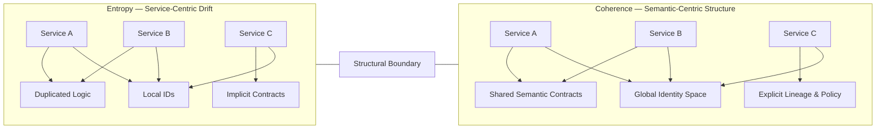

# MatrixOne Design Philosophy vs SaaS Architecture Patterns

---

## Purpose of This Document

This canvas captures a structured comparison between:

- Industrial-grade semantic runtime philosophy (as exemplified by MatrixOne-style systems)
- Common SaaS-era architectural patterns

The goal is not nostalgia or criticism, but architectural clarity.

---

# Part I — MatrixOne Engineering Axioms (Abstracted)

## 1. Identity First

All objects possess a stable, immutable identity (OID).\
Relationships, lifecycle, and versioning evolve around identity.

Implication:

- Identity is the semantic anchor
- Version does not replace identity
- Relationships reference identity, not transient state

---

## 2. Behavior Is Data

Policies, lifecycles, trigger wiring, and configuration are stored as data.

Implication:

- System behavior is declarative
- Evolution does not require code recompilation
- Governance lives in metadata

---

## 3. Explicit Schema Evolution

Schema upgrades are scriptable, versioned, and repeatable.

Implication:

- Upgrade is part of architecture
- Migration is deterministic
- Evolution is controlled, not accidental

---

## 4. Transaction as a First-Class Concept

Lifecycle transitions, revisions, and trigger execution operate within explicit transaction boundaries.

Implication:

- Consistency is designed, not assumed
- Promotion/revision semantics are atomic
- Side effects are bounded

---

## 5. Runtime-Visible Metadata

Schema and metadata are introspectable at runtime.

Implication:

- Attribute dictionaries are accessible
- Relationship types are discoverable
- Policies and rules are queryable

---

## 6. System as Long-Lived Asset

Architecture assumes 15–30 year lifespan.

Implication:

- Strong constraints
- Strong semantic contracts
- Upgrade path is mandatory

---

## 7. Upgrade Is Architectural

Upgrade mechanisms are designed into the system.

Implication:

- Not a DevOps afterthought
- Not manual SQL patching
- Not fragile migration scripts

---

## 8. Runtime Is Inspectable

Tracing, logging, and lifecycle execution visibility are intrinsic.

Implication:

- Debugging is structural
- Behavior can be audited
- Execution path is observable

---

# Part II — Common SaaS Architectural Patterns

| MatrixOne Axiom       | Common SaaS Pattern         | Structural Risk           |
| --------------------- | --------------------------- | ------------------------- |
| Identity First        | Service-scoped IDs          | Fragmented identity space |
| Behavior as Data      | Logic in services           | Behavior duplication      |
| Explicit Schema       | Incremental DB migrations   | Drift over time           |
| Explicit Transactions | Eventual consistency chains | Semantic inconsistency    |
| Runtime Metadata      | Compile-time annotations    | Opaque runtime            |
| Long-lived model      | Short product cycles        | Structural entropy        |
| Architectural Upgrade | Ops-driven upgrades         | Fragile evolution         |
| Inspectable Runtime   | Logging as add-on           | Low semantic traceability |

---

# Part III — Where SaaS Optimizes Differently

SaaS systems often optimize for:

- Rapid iteration
- Deployment frequency
- DevOps autonomy
- Horizontal scalability
- Lower entry barrier

This does not imply inferior engineering — only a different optimization function.

---

# Part IV — Structural Insight

The tension is not "old vs new".

It is:

Industrial Semantic Core\
vs\
Application-Centric Service Architecture

One optimizes for semantic longevity. One optimizes for delivery velocity.

The architectural opportunity lies in combining:

- Identity stability
- Explicit evolution
- Runtime introspection

with:

- Cloud-native deployment
- Modular runtime boundaries
- Horizontal scaling

---

# Part V — Open Questions for Modern Architecture

1. Can identity remain global while services remain autonomous?
2. Can metadata be runtime-visible in distributed systems?
3. Can transactions be semantically bounded across realms?
4. Can upgrade paths be first-class in cloud-native systems?
5. Can semantic depth coexist with SaaS velocity?

---

This canvas is intended as a foundation for further refinement, not a conclusion.

---

# Part VI — Engineering Semantics Layer as Bridge Architecture

The conflict between industrial semantic systems and SaaS architectures is not irreconcilable.

A bridge layer can exist.

We call this layer the **Engineering Semantics Layer (ESL)**.

## 1. Position in the Stack

Application Services\
↑\
Engineering Semantics Layer\
↑\
Storage / Infrastructure

The ESL is not a UI layer. It is not a database abstraction layer. It is a semantic runtime layer.

---

## 2. Core Responsibilities of the ESL

### A. Identity Unification

- Provide stable global identity (OID / GOID)
- Allow local service autonomy while preserving global reference integrity
- Separate identity from storage location

### B. Semantic Contracts

- Define types, attributes, relationships, and policies declaratively
- Keep behavior configurable rather than embedded in service code
- Expose semantic rules as first-class runtime objects

### C. Version & Lineage Semantics

- Treat revision, snapshot, and lineage as structural concepts
- Allow multiple evolution paths without identity fragmentation

### D. Explicit Evolution Path

- Schema evolution is part of the semantic layer
- Upgrades are versioned and introspectable
- Backward compatibility is explicit, not accidental

### E. Runtime Introspection

- Metadata is queryable
- Policies are inspectable
- Execution paths are traceable at semantic level

---

## 3. How ESL Preserves Industrial Strength

From the industrial side, ESL preserves:

- Identity stability
- Deterministic evolution
- Transactional semantic boundaries
- Long-term structural coherence

---

## 4. How ESL Enables SaaS Velocity

From the SaaS side, ESL enables:

- Independent service deployment
- Cloud-native scalability
- Modular runtime boundaries
- Decoupled infrastructure choices

Services can evolve rapidly without corrupting semantic integrity.

---

## 5. Key Principle

Infrastructure may scale horizontally. Services may iterate quickly.

But semantic truth must remain vertically coherent.

The Engineering Semantics Layer ensures:

Velocity does not destroy structure.

---

## 6. Strategic Implication

Instead of choosing between:

- Heavy industrial monolith
- Fragmented SaaS microservices

We introduce a third model:

Composable Semantic Core + Cloud-Native Execution.

This is not regression. It is architectural synthesis.

---

# Part VII — Structural Diagram: Engineering Semantics as Structural Spine

Below is a more declarative, manifesto-style diagram.

The Engineering Semantics Layer is not a middle utility layer. It is the structural spine of the system.

```mermaid
flowchart TB

    %% Clean, stable layout version (GitHub-safe)

    subgraph V[Velocity Zone - Rapid Change]
        direction LR
        V1[UI / Clients] --> V2[APIs / Gateways] --> V3[Domain Microservices]
    end

    subgraph S[ENGINEERING SEMANTICS LAYER - STRUCTURAL SPINE]
        direction LR
        S1[Global Identity Space (OID/GOID)]
        S2[Type System & Attribute Dictionary]
        S3[Lifecycle & Policy Semantics]
        S4[Version / Lineage Model]
        S5[Semantic Transaction Boundary]
        S6[Runtime Introspection & Trace]

        S1 --> S2 --> S3 --> S4 --> S5 --> S6
    end

    subgraph I[Scale Zone - Horizontal Infrastructure]
        direction LR
        I1[(Databases)] --> I2[(Object Storage / Vault)] --> I3[(Event Streams)] --> I4[(Containers / Cloud Runtime)]
    end

    %% Vertical structural spine
    V3 --> S1
    S6 --> I1

    %% Events inform lineage
    I3 -. contributes evidence .-> S4
```


## Manifest Interpretation

- The **Velocity Zone** changes frequently.
- The **Scale Zone** expands horizontally.
- The **Engineering Semantics Layer** remains vertically coherent.

Velocity may fluctuate. Infrastructure may scale.

But identity, lineage, policy, and semantic truth must remain stable.

The ESL is not middleware. It is not ORM. It is not API glue.

It is the architectural contract that prevents distributed systems from dissolving into semantic entropy.

---

# Part VIII — Entropy vs Coherence: Structural Divergence

Modern distributed systems naturally drift toward entropy when semantic control is implicit.

Below is a contrast diagram illustrating structural entropy versus semantic coherence.



## Interpretation

### Entropy Model

- Each service defines its own identity rules.
- Business logic fragments across boundaries.
- Contracts are implicit and drift over time.
- Event chains replace semantic guarantees.

Result:

Structural entropy increases with scale.

---

### Coherence Model

- Identity is unified.
- Semantic contracts are centralized but not monolithic.
- Lineage and policy are explicit.
- Services remain autonomous but semantically aligned.

Result:

Scale increases without destroying structural integrity.

---

## Core Principle

Distributed systems do not collapse because of load. They collapse because of semantic drift.

The Engineering Semantics Layer is the mechanism that converts:

Horizontal scale  →  Vertical coherence.

Without it, entropy is inevitable. With it, complexity becomes structured evolution.

---

# Part IX — Semantic Drift Case Study (Evolution Comparison)

To make the entropy vs coherence contrast concrete, consider a realistic domain scenario:

## Scenario: Product Lifecycle with Variant Expansion

Initial State:

- A "Product" entity
- Basic attributes (name, version, owner)
- Simple publish lifecycle

Over time, new requirements emerge:

- Product variants (regional, hardware revisions)
- Regulatory attributes per market
- Cross-product compatibility rules
- Deprecation and replacement tracking
- External integrations (ERP, CRM, partner portals)

We compare two evolutionary paths.

---

## Path A — Service-Centric Growth (Drift Model)

### Phase 1

- Product Service owns product table
- Variant logic embedded in Product Service

### Phase 2

- Regional Service adds regulatory fields
- ERP Adapter duplicates product ID mapping
- Compatibility handled via event subscriptions

### Phase 3

- Deprecation handled by new Lifecycle Service
- Replacement links stored in separate relation table
- Different services introduce their own “status” definitions

### Resulting Structure

- Multiple ID translations
- Divergent lifecycle semantics
- Inconsistent version meaning
- Event-driven reconciliation logic
- Growing dependency graph

Symptoms:

- “Why does ERP show a different state?”
- “Which service owns replacement truth?”
- “Why did compatibility break after minor update?”

This is semantic drift.

Each change is locally correct. The system globally loses coherence.

---

## Path B — Semantic-Layer-Governed Evolution (Coherence Model)

### Phase 1

- Product identity defined in global identity space
- Variant defined as typed relationship
- Lifecycle declared in metadata

### Phase 2

- Regulatory attributes added to schema dictionary
- ERP integration consumes semantic identity directly
- Compatibility modeled as explicit relationship type

### Phase 3

- Deprecation and replacement encoded in policy semantics
- Version and lineage tracked structurally
- All services consume shared semantic contracts

### Resulting Structure

- One identity space
- One lifecycle definition
- Explicit relationship semantics
- Traceable version lineage
- Deterministic evolution path

Symptoms:

- Cross-system state remains aligned
- Version meaning is stable
- New integrations plug into semantic core
- Scale increases without fragmentation

This is structured evolution.

---

## Structural Difference

Drift Model:

Change → Patch → Event → Compensation → Drift

Coherence Model:

Change → Schema Update → Semantic Contract → Stable Propagation

---

## Long-Term Impact

After 5–10 years:

Drift Model:

- Integration cost grows non-linearly
- Identity reconciliation becomes a permanent tax
- Refactoring requires system-wide rewrites

Coherence Model:

- Schema evolution remains incremental
- Identity remains stable
- Services remain replaceable
- Infrastructure can change without semantic collapse

---

## Final Observation

Semantic drift is not caused by incompetence. It is caused by the absence of a structural semantic anchor.

When identity, lifecycle, and lineage are explicit and centralized at the semantic layer, complexity compounds in structure — not in chaos.

---

# Part X — The Re-centralization Paradox of Microservices

Microservices are often introduced to decentralize control.

Ironically, at scale, they tend to re-centralize — but in less explicit ways.

This is the Re-centralization Paradox.

---

## Stage 1 — Intentional Decentralization

Initial goals:

- Autonomous teams
- Independent deployments
- Service-level ownership
- Reduced coordination overhead

Architecture pattern:

- Each service owns its schema
- Each service defines its own domain rules
- APIs replace shared database access

At this stage, decentralization works.

---

## Stage 2 — Hidden Coupling Emerges

As the system grows:

- Cross-service workflows increase
- Identity must be reconciled
- Version meaning diverges
- Reporting requires cross-domain joins

Emergent artifacts appear:

- API gateways become logic hubs
- Shared "common" libraries grow rapidly
- Event orchestration layers accumulate rules
- Data lakes attempt to reconstruct global truth

The system begins to recentralize — but implicitly.

---

## Stage 3 — Accidental Central Authority

Without an explicit semantic core, systems often recentralize through:

- A dominant "core" service that others depend on
- A centralized reporting database
- A workflow engine acting as coordination brain
- An integration platform becoming de facto semantic owner

But this centralization:

- Is not architecturally declared
- Lacks formal semantic contracts
- Is fragile and hard to evolve

It is centralization by necessity, not by design.

---

## Why This Happens

Distributed systems require:

- Shared identity
- Shared lifecycle meaning
- Shared version semantics
- Shared contract definitions

If these are not formalized in a semantic layer, they reappear informally somewhere else.

The system cannot function without coherence. So it rebuilds coherence implicitly.

---

## The Structural Insight

Microservices do not eliminate centralization. They postpone and obscure it.

The question is not:

"Should we centralize?"

The real question is:

"Where does semantic authority live?"

If it lives nowhere explicitly, it will emerge somewhere accidentally.

---

## ESL as Explicit, Controlled Centralization

The Engineering Semantics Layer does not contradict microservices. It prevents accidental re-centralization.

It provides:

- Explicit identity authority
- Explicit lifecycle definitions
- Explicit lineage semantics
- Explicit contract governance

Services remain operationally autonomous.

But semantic authority is declared — not emergent.

---

## Final Principle

Operational decentralization is healthy. Semantic decentralization is entropy.

The mature architecture separates:

Autonomy of execution\
from\
Authority of meaning.

The Engineering Semantics Layer formalizes that authority.

